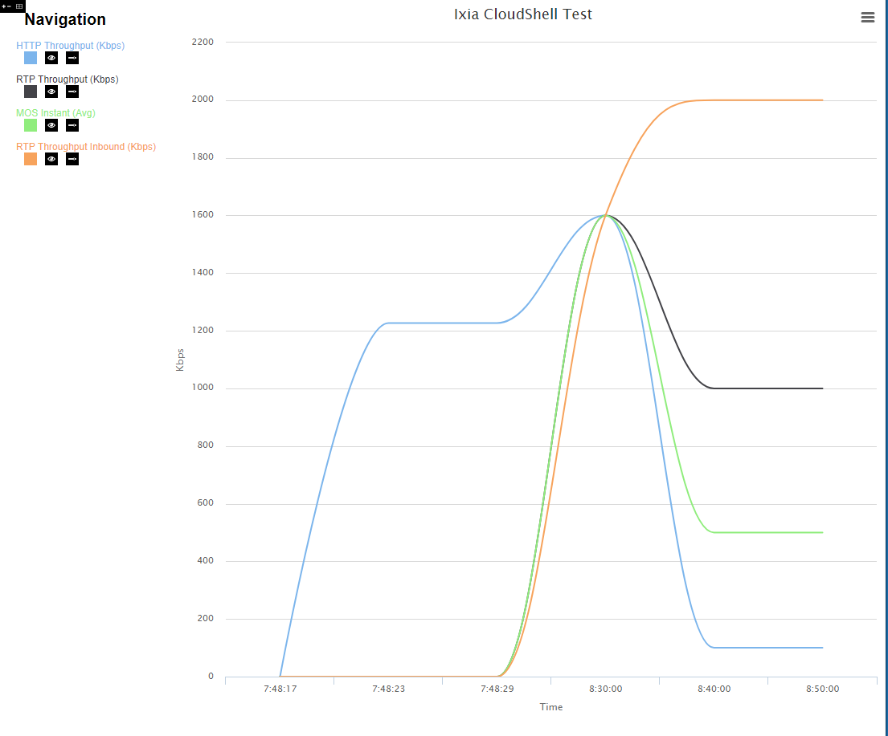

# RealTimeGraph

## About
This website will take data in a CSV format and do real time graphing in both a line chart and table view.



## Use
* located in wwwroot/Graph.html
* uses highcharts to generate graph
* all javascript includes are in js subfolder, all stylesheets are in css sub folder, all images uses are in img subfolder
* Markup is in Graph.html then all code to make it work is in js/Graph.js
* recursive functions are prefaced with r_
* Data being graphed is in Data/{reservationID} subfolder
	* initial load for graph is the STAT_FILE.txt
	* we track number of lines in STAT_FILE on first run thru then send that number into r_updateGraph which ignores all lines before that number, apennding later lines to graph
* Graph.js is very well commented to make it obvious what it does
* If you change Graph.js, please update the header information
* future improvements if performance is bad is that right now it reads the entire txt file every 2 seconds and ignores the first x rows 
	* it knows x since that is how many rows it read previously
	* move this logic into server side code to just send the remaining lines since last call to less to parse clientside

## CloudShell Changes
If using CloudShell, you should do the following:

* Create new IIS website on new port
* root directory for this is `C:\inetpub\wwwroot`
* move this directory into above
* The only file changed is `C:\Program Files (x86)\QualiSystems\CloudShell\Portal\Areas\RM\Views\TopologyDiagram\_WorkspaceToolbar.cshtml`
* to add a graph button to the toolbar, add the following code before closing `}` in the `@if (Model.IsReservation())` statement 

```html
<span class="action-btn">
    <button class="btn-icon btn-toggle"  value="Open Window" onclick="window.open('http://63.97.44.20/Graph.html?RES=@res.Id')">
        
    </button>
</span>
```

## Viewing 
* Visit the webserver http://IP:port/Graph.html?RES=Foo 
* Foo is included as dummy data